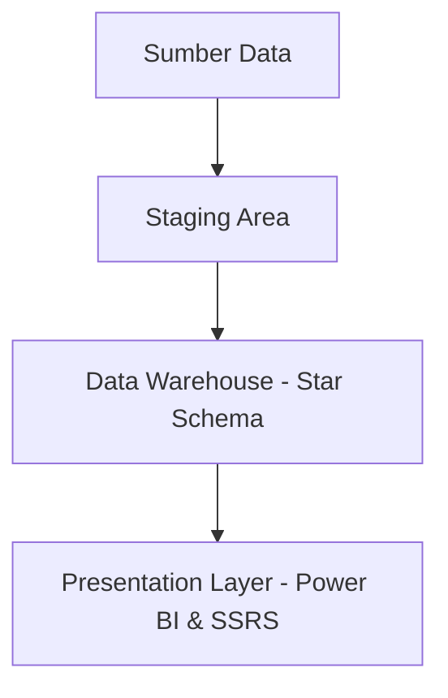

# 🏛️ Perancangan Data Warehouse Disdukcapil 🇮🇩
**Kabinet Data Bersatu** - Sains Data ITERA | 2025  
📁 Proyek Akademik | 🗃️ SQL Server • SSMS • Power BI • SSRS


---

## 📚 Ringkasan Proyek

Repositori ini berisi dokumentasi lengkap proyek perancangan **Data Warehouse (DW)** untuk instansi **Dinas Kependudukan dan Pencatatan Sipil (Disdukcapil)** yang bertujuan untuk meningkatkan efisiensi, transparansi, dan akurasi layanan publik berbasis data.

---

## 🎯 Tujuan Sistem

- 📌 Integrasi data antar wilayah
- 📊 Analisis multidimensi penduduk dan layanan
- ⏱️ Pengambilan keputusan real-time
- 📈 Visualisasi interaktif via Power BI

---

## 🧩 Ruang Lingkup

- **Sumber Data**: SIAK, sistem pelayanan online, input manual kecamatan, laporan bulanan
- **Fakta**: Population, Document Requests, Service Performance, Migration
- **Dimensi**: Time, Wilayah, Gender, Age_Group, Jenis_Dokumen, Status, Jenis_Layanan, Pegawai, Alasan_Pindah
- **Visualisasi**: Power BI dashboard & SSRS reporting

## 🧱 Arsitektur Sistem - Three-Tier Architecture



## 🔄 Alur Proses ETL
###  ⚠️ Semua proses ETL dilakukan secara manual menggunakan SQL Query di SSMS.
Salah satu contoh skrip ETL manual via SSMS
```bash
INSERT INTO dim_jenis_dokumen (kode, nama)
SELECT DISTINCT kode_dok, jenis_dokumen
FROM staging_permohonan
WHERE jenis_dokumen IS NOT NULL;
```

## 📁 Struktur Data Warehouse

### 📊 Tabel Fakta

| Nama Tabel | Deskripsi |
|------------|-----------|
| `fakta_population` | Jumlah penduduk |
| `fakta_document` | Permohonan dokumen |
| `fakta_service` | Evaluasi pelayanan publik |
| `fakta_migration` | Data perpindahan penduduk |

### 🧩 Tabel Dimensi

| Nama Dimensi | Atribut Utama |
|-------------|---------------|
| `dim_waktu` | Tahun, Bulan, Hari |
| `dim_wilayah` | Provinsi, Kab/Kota, Kecamatan |
| `dim_gender` | Jenis Kelamin |
| `dim_jenis_dokumen` | KTP, KK, Akta, dll |
| `dim_status` | Status permohonan |
| `dim_pegawai` | Nama Pegawai, Jabatan |
| `dim_alasan_pindah` | Alasan migrasi (kerja, pendidikan) |

---

## 🛠️ Tools & Teknologi

| Komponen | Tools |
|----------|-------|
| **Database** | Microsoft SQL Server |
| **ETL** | **Manual SQL Query via SSMS** |
| **Modeling** | SSMS |
| **Visualisasi** | Power BI, SSRS |
| **Pemantauan** | SQL Profiler, DMV |

---

## 📊 Tampilan Visualisasi

### 📌 Dashboard Interaktif - Power BI
### 📄 Laporan Formal - SSRS

#### 🧭 Fitur Visualisasi:
- Persebaran & pertumbuhan penduduk
- Status permohonan dokumen  
- Kinerja pelayanan publik
- Tren migrasi penduduk

---

## 🧠 Evaluasi & Rencana Pengembangan

### ✅ Yang Berhasil
- ✅ ETL otomatis dan terjadwal
- ✅ Konsolidasi data dari 4 sumber utama
- ✅ Visualisasi responsif dan informatif

### ⚠️ Perlu Ditingkatkan
- Validasi data pasca-ETL
- Optimasi performa query besar
- Penambahan sumber data baru (e.g. survei)

---

## 👨‍💻 Tim Proyek – Kabinet Data Bersatu

| Nama | NIM | Role |
|------|-----|------|
| 🧠 **Baruna Abirawa** | 122450097 | **Ketua** |
| Sesilia Putri Subandi | 122450012 | Anggota |
| Oktavia Nurwinda Puspitasari | 122450041 | Anggota |
| Safitri | 122450071 | Anggota |
| Dinda Nababan | 122450120 | Anggota |

---

## 📂 Struktur Repositori

```
📦Disdukcapil-DW
 ┣ 📁 Dataset/
 ┃ ┣ 📄 Dataset Aplikasi SIAK.csv
 ┃ ┣ 📄 Dataset Kepindahan.csv
 ┃ ┗ 📄 Dataset Pelayanan Online.csv
 ┣ 📁 misi 1/
 ┃ ┗ 📄 Misi1_Kelompok 10_DW_RB.pdf
 ┣ 📁 misi 2/
 ┃ ┗ 📄 Misi2_Kelompok 10_DW_RB.pdf
 ┣ 📁 misi 3/
 ┃ ┣ 📄 DW_DISDUKCAPIL.sql
 ┃ ┗ 📄 Misi3_Kelompok 10_DW_RB.pdf
 ┗ 📄 README.md
```

---

## 📃 Lisensi

Repositori ini dibuat untuk kepentingan akademik di **Institut Teknologi Sumatera** dan tidak diperuntukkan untuk distribusi komersial.

---

<div align="center">

**Dibuat dengan 💡 oleh Kabinet Data Bersatu | Sains Data ITERA 2025**

</div>
